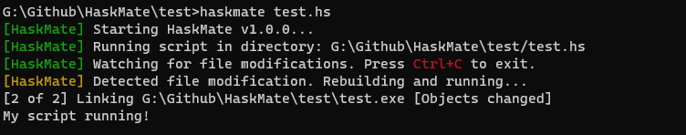

# HaskMate: Your Haskell Development Companion

HaskMate is a Haskell-based project monitoring and automation tool, designed to aid Haskell developers in streamlining their workflow. It continuously watches for changes in your Haskell source files and automatically triggers a rebuild and re-execution of the project whenever a modification is detected.

Crafted for simplicity and efficiency, HaskMate keeps an eye on your file modifications, relieving you from the constant back-and-forth manual building process. It allows developers to focus on what matters the most: writing high-quality Haskell code. With built-in support for smart detection and colorful console outputs, HaskMate is more than just a development tool; it's your mate in Haskell development.

Whether you're prototyping a new function, or debugging a complex piece of logic, HaskMate stands by you, ensuring your changes are instantly built and run, providing immediate feedback on your modifications. It's like having a vigilant companion by your side, dedicated to making your Haskell programming experience smoother and more enjoyable.

Embrace the Haskell way with HaskMate!

## Installation and Usage

(COMIGN SOON)

## Key Features

- **Automatic File Watch**: HaskMate tracks modifications to your Haskell source files in real-time. Once you save a change, it kicks into action.
- **Instant Build and Rerun**: Upon detecting a file modification, HaskMate triggers a rebuild of your project, followed by an execution of the updated build.
- **Smart Detection**: HaskMate employs an efficient change detection mechanism to ensure no unnecessary builds are run.
- **Colored Console Outputs**: Keep track of what's happening through informative, color-coded console outputs.

## Future Plans

- Ability to customize the file watch pattern to include or exclude specific files or directories.
- Integration with popular Haskell test frameworks for automated testing.

## Contributing

We warmly welcome and appreciate contributions from the community. To contribute:

1. Fork the repository.
2. Create a new branch for your feature or bug fix (`git checkout -b feature/YourFeature`).
3. Make your changes.
4. Commit your changes (`git commit -m 'Add some feature'`).
5. Push to the branch (`git push origin feature/YourFeature`).
6. Open a new Pull Request.

Before submitting your Pull Request, please make sure to follow our coding style and conventions. Your contributions make HaskMate better - thank you!